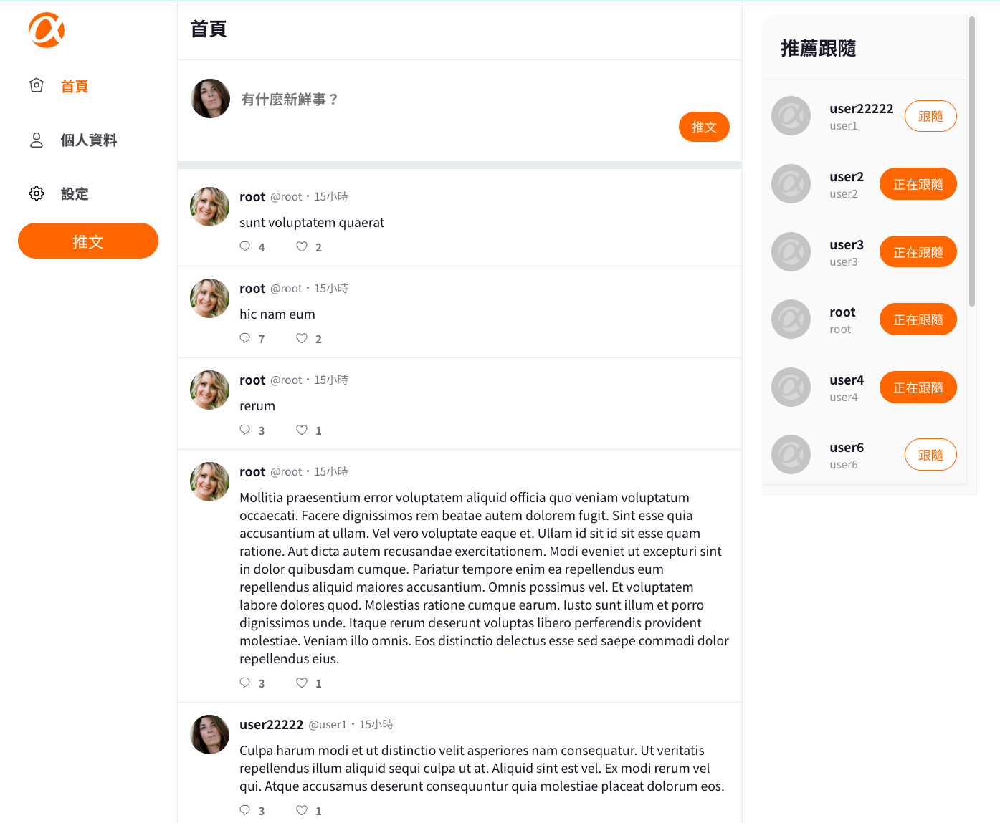

# Simple Twitter 前後分離協作專案 

## 作品連結：[Simpe Twitter](https://owenlu0125.github.io/login)

## 後端repo連結：[後端連結](https://github.com/tschiang23/twitter-api-2020)
## 頁面截圖：

## 功能說明

前台： 
使用者可以註冊/登入帳號、推文、回覆推文、設定帳號資料、編輯個人資訊、跟隨/取消跟隨其他使用者、查看單一偏貼文及該篇文章的回覆內容。 

後台： 
管理者可以登入帳號、觀看推文清單及使用者列表、刪除推文。

##  使用說明

      1.  確認已經安裝 node.js 與 npm
      2.  clone 專案
      3.  終端機進入資料夾並輸入：`$ npm `
      4.  安裝完畢後，繼續輸入：`$ npm run start`

## 測試帳號

      前台：

      ---
      Account: user1
      Password: 12345678
      ---

      後台：

      ---
      Account: root
      Password: 12345678
      ---